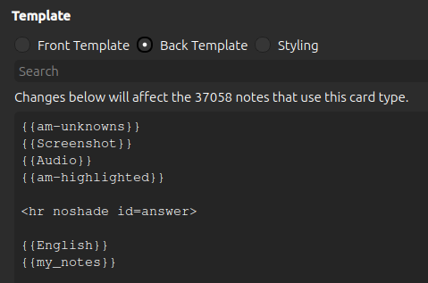
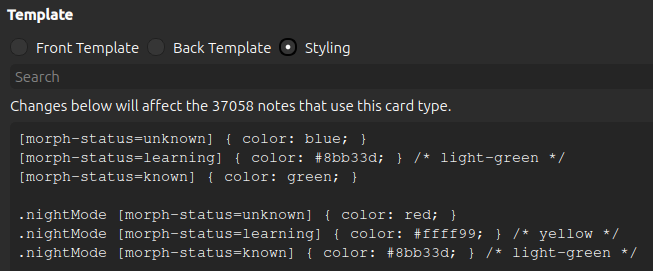

# Highlighting

> **CAUTION!** Create a backup of your cards before you start using this feature. Any text in the highlight field is
> overwritten every [Recalc](../usage/recalc.md). Make sure you don't accidentally select a
> field that has data you care about.


AnkiMorphs allows for automatic color-coding of morphs based on their learning status (how well you know them). A
highlighted version of the text
in the [Note Filter: Field](../setup/settings/note-filter.md#field) is placed in the
selected [Extra Fields: Highlighted-field](../setup/settings/extra-fields.md#highlighted).

<video autoplay loop muted controls>
    <source src="../../img/highlighting.mp4" type="video/mp4">
</video>

I recommend only putting the highlighted-field on the back of cards. The reason for this is that, in order to get the best
results, you want your SRS experience to simulate real life as much as possible. When reading in real life, you aren’t
going to be told which words you know and which you don’t. So, it makes sense to have your sentence cards reflect this.

### Card Template

Here is a simplified example of some of the changes you need to make to your card template to get the results shown
above. Notice that the "highlighted"-field is substituted for the "Japanese"-field on the back of the card.




You also need to add the following to the "Styling" section (choose any color you want):

``` css
[morph-status=unknown] { color: #f75464; } /* red */
[morph-status=learning] { color: #8bb33d; } /* light-green */
[morph-status=known] { color: green; }
```

It’s also possible to use “background-color”:

``` css
[morph-status=unknown] { background-color: #ffff99; } /* yellow */
[morph-status=learning] { background-color: #f2f2f2; } /* gray */
[morph-status=known] { background-color: #b3e6cc; } /* green */
```



### Duplicate Audio Problem


When the back of a card also has an audio field and not just the front, then both might play after each other when you
press "Show Answer". To prevent both playing you can do the following:

1. Go to deck-options
2. Scroll down to the "Audio" section
3. Activate "Skip question when replaying answer"