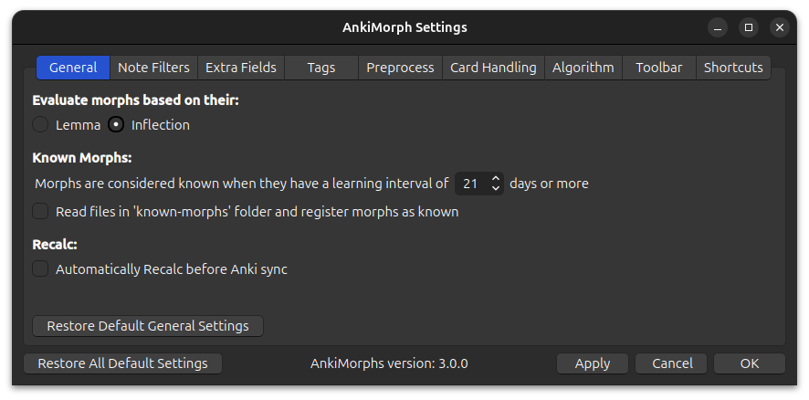

# General

* **Evaluate morphs based on their**:  
  todo

* **Learning interval of known morphs**:  
  This is variable is used when text is [highlighted](../../setup/settings/extra-fields.md#using-am-highlighted), and it
  can determine [U and A numbers](../../installation/changes-to-anki.md#toolbar).

* **Read files in 'known-morphs' folder and register morphs as known**:  
  Import known morphs from the known-morphs folder. Read more in [Settings Known Morphs](../setting-known-morphs.md).

* **Automatically Recalc before Anki sync**:  
  Recalc automatically runs before Anki syncs your card collection.
  > **Note**: If you use the [FSRS4Anki Helper add-on](https://ankiweb.net/shared/info/759844606) with an `Auto [...]
  after sync`-option enabled, then this can cause a bug where sync and recalc occurs simultaneously.
  