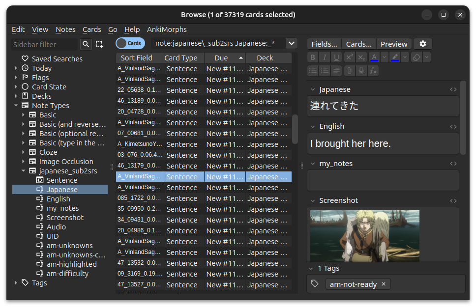

# Note Filter


AnkiMorphs only analyzes and sorts cards that matches at least one "note filter"; if you don't specify any note filters
then AnkiMorphs
won't do anything, so this is a necessary step.

Each note filter contains:

* [Note Type](note-filter.md#note-type)
* [Tags](note-filter.md#tags) (optional)
* [Field](note-filter.md#field)
* [Morphemizer](note-filter.md#morphemizer)
* [Read & Modify](note-filter.md#read--modify) (optional)

## Note Type

To find a card's note type do the following:

<video autoplay loop muted controls>
    <source src="../../../img/note-type.mp4" type="video/mp4">
</video>

1. Go to Browse
2. Find a card you want AnkiMorphs to analyze and sort
3. Right-click the card
4. Click Info
5. See Note Type

All the cards in my "Japanese Sentences" deck (and sub-decks) have the same note type, but that might not be the case
for your decks.

Another thing you can do is look through the "Note Types" in the left sidebar and until you find the cards you are
after.


## Tags

You can further filter AnkiMorphs to only work on cards with a certain note type **and** specific tag(s).

Take for
example a collection with 3K cards with the tag "movie", 6K cards with the tag "demon-slayer", and 1K cards having both.
If you specify the tags:
```text
movie, demon-slayer
```
Then AnkiMorphs will then get the subset of
cards that have both, i.e. 1k cards.

## Field

This is the field on the card AnkiMorphs reads and analyzes, which is then used to sort the card.



1. Go to Browse
2. Find the note type in the left sidebar
3. Find the field you care about

In my case the field I'm interested in is "Japanese"


## Morphemizer

This is the [parsing dictionary](../../installation/parsing-dictionary.md) AnkiMorphs uses to find morphs.

## Read & Modify

If for whatever reason you don't want AnkiMorphs to read one of the note filters you have set up then you
can uncheck the "Read" option.

If you uncheck “Modify”, AnkiMorphs will analyze the
specified fields of cards (and update the database of learned/mature Morphs based on them), but won’t actually reorder
or change the cards in any way.


